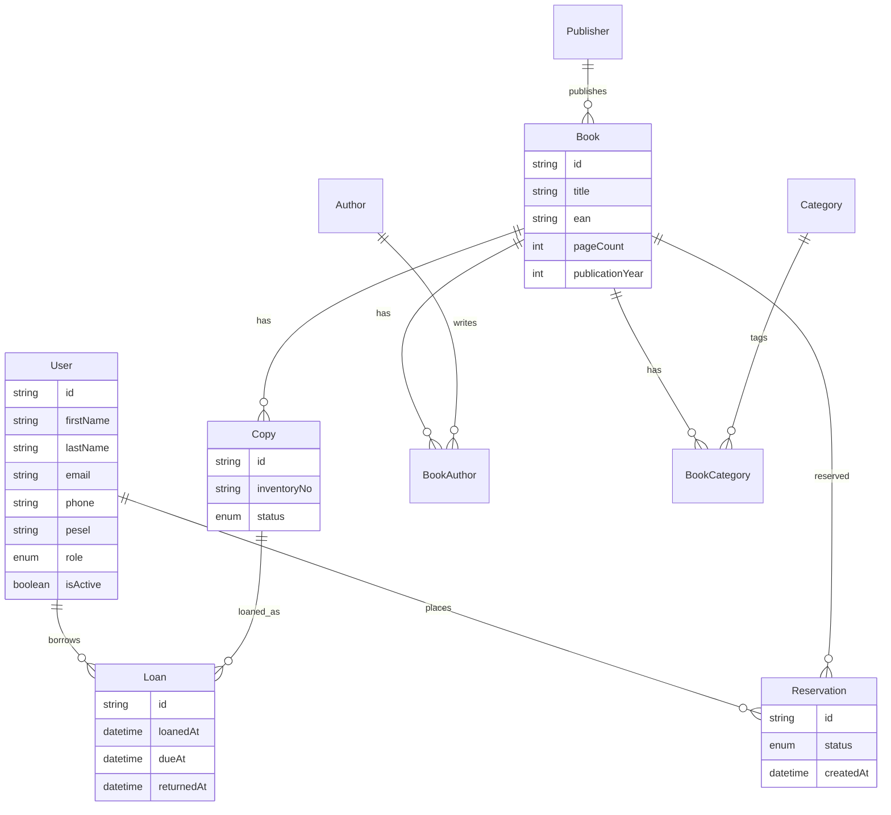

# Baza danych książek — system wypożyczeń bibliotecznych

Referencja modelu danych, logiki biznesowej i funkcji aplikacji BD2P oraz instrukcja uruchomienia (T3 Stack: Next.js, TypeScript, Tailwind, tRPC, Prisma, PostgreSQL, Better Auth, Biome, pnpm).

Nazwy modeli i pól w schemacie są po angielsku ([prisma/schema.prisma](prisma/schema.prisma)). Ten dokument opisuje, jak encje się łączą, jakie reguły obowiązują w systemie i co oferuje aplikacja.

## Uruchomienie

Wersja wdrożona jest dostępna w przeglądarce: [https://bd2p.vercel.app/](https://bd2p.vercel.app/).

Wymagania (lokalnie): Node.js, pnpm, Docker (opcjonalnie — skrypt `start-database.sh` uruchamia Postgresa).

1. Skopiuj env: `cp .env.example .env` i ustaw:
   - `DATABASE_URL` — połączenie z PostgreSQL,
   - `BETTER_AUTH_SECRET` — sekret Better Auth (np. `openssl rand -base64 32`),
   - `BETTER_AUTH_URL` — adres aplikacji (lokalnie `http://localhost:3000`).
2. Uruchom Postgres (np. `./start-database.sh` albo własna instancja).
3. Zainstaluj zależności: `pnpm install`
4. Zsynchronizuj schemat: `pnpm db:push` (nakłada też ograniczenia z [prisma/sql/constraints.sql](prisma/sql/constraints.sql): indeks, trigger, CHECK). Projekt nie używa migracji Prisma (brak katalogu `prisma/migrations`) — schemat to `db:push`, a ograniczenia SQL można nałożyć osobno przez `pnpm db:constraints`.
5. Wypełnij dane testowe: `pnpm db:seed` (skrypt [prisma/seed.ts](prisma/seed.ts))
6. Dev server: `pnpm dev` → [http://localhost:3000](http://localhost:3000)

Auth: **Better Auth** z **email + hasło** (`emailAndPassword`). Endpointy pod `/api/auth/*`. Hasła są w tabeli `account` (`Account.password`), nie w `User`.

Przydatne skrypty: `pnpm check` (Biome), `pnpm typecheck`, `pnpm db:studio`, `pnpm db:seed`, `pnpm db:constraints`, `pnpm test`.

## Seed bazy (`pnpm db:seed`)

Skrypt [prisma/seed.ts](prisma/seed.ts) wypełnia bazę danymi testowymi. Konfiguracja komendy: `migrations.seed` w [prisma.config.ts](prisma.config.ts) (`tsx prisma/seed.ts`).

### Uruchomienie

1. Postgres działa i w `.env` jest ustawione `DATABASE_URL`.
2. Schemat zsynchronizowany: `pnpm db:push` (jeśli jeszcze nie).
3. Seed: `pnpm db:seed`.

> **Uwaga: seed usuwa wszystkie dane.** Przed wstawieniem danych testowych czyści tabele użytkowników, kont, sesji, katalogu, wypożyczeń i rezerwacji — także konta zarejestrowane ręcznie. Nie uruchamiaj go na bazie produkcyjnej ani na takiej, której danych chcesz zachować.

Seed jest **powtarzalny**: każde uruchomienie czyści dane i wstawia je od nowa (wynik za każdym razem ten sam zestaw danych testowych). Na początku nakłada też ograniczenia z [prisma/sql/constraints.sql](prisma/sql/constraints.sql).

### Konta testowe

Hasło wszystkich kont: `12341234` (hash Better Auth w `Account.password`).

| Rola        | E-mail                                                   | Liczba |
| ----------- | -------------------------------------------------------- | ------ |
| `LIBRARIAN` | `bibliotekarz1@example.com`, `bibliotekarz2@example.com` | 2      |
| `MEMBER`    | `czytelnik1@example.com` … `czytelnik250@example.com`    | 250    |

### Ilości i zawartość

| Encja            | Ilość / zakres                                                                                                              |
| ---------------- | --------------------------------------------------------------------------------------------------------------------------- |
| User `LIBRARIAN` | 2                                                                                                                           |
| User `MEMBER`    | 250                                                                                                                         |
| Author           | 400                                                                                                                         |
| Publisher        | 50                                                                                                                          |
| Category         | 20                                                                                                                          |
| Book             | 2000 (unikalne EAN)                                                                                                         |
| Copy             | 1–4 na książkę (~3500–5000; typowo ~5000), unikalne `inventoryNo`                                                           |
| Loan             | historia + aktywne: termin 14 dni; zwroty na czas / po terminie; aktywne w tym przeterminowane; max 5 aktywnych na `MEMBER` |
| Reservation      | 60 (`PENDING` / `FULFILLED` / `CANCELLED`)                                                                                  |

Dodatkowe reguły w seedzie: książki mają 1–3 autorów i 1–2 kategorie; status `Copy` = `LOANED` przy aktywnym wypożyczeniu; mała frakcja egzemplarzy ma status `LOST` lub `MAINTENANCE`.

## Testy

Testy automatyczne działają na [Vitest](https://vitest.dev/): `pnpm test` (jednorazowy przebieg).

- **Jednostkowe** (`tests/unit`, bez bazy): walidacja PESEL (`src/lib/pesel.ts`), budowanie adresów i parametrów katalogu oraz panelu bibliotekarza (`src/lib/catalog-query.ts`, `src/lib/librarian-query.ts`), reguły wypożyczeń i parsowanie autorów (`src/lib/library-rules.ts`: termin 14 dni, limit 5, blokada przy przeterminowanych i nieaktywnym koncie, rozpoznawanie naruszeń unikalności).
- **Integracyjne bazy** (`tests/db`): sprawdzają ograniczenia z [prisma/sql/constraints.sql](prisma/sql/constraints.sql) — jedno aktywne wypożyczenie na egzemplarz (indeks), CHECK `dueAt > loanedAt`, trigger `Copy.status` (`LOANED` / `AVAILABLE`, bez zmiany `LOST` i `MAINTENANCE`) oraz `NOT NULL`, CHECK i unikalność PESEL.

Testy bazy wymagają `DATABASE_URL` i zsynchronizowanego schematu (`pnpm db:push`); bez `DATABASE_URL` są pomijane. Przed ich uruchomieniem `tests/db/global-setup.ts` nakłada ograniczenia SQL (idempotentnie). Każdy test działa w transakcji, która jest zawsze wycofywana i tworzy własne dane, więc nie zmienia zawartości bazy — mimo to nie uruchamiaj ich na bazie produkcyjnej.

## Wdrożenie (Vercel / produkcja)

Aplikacja działa na Vercel ([https://bd2p.vercel.app/](https://bd2p.vercel.app/)). Build to `next build`, a `postinstall` generuje klienta Prisma (`prisma generate`). **Vercel nie zmienia schematu ani nie nakłada ograniczeń SQL** — trzeba to zrobić ręcznie na bazie produkcyjnej.

1. Na Vercel ustaw zmienne środowiskowe: `DATABASE_URL`, `BETTER_AUTH_SECRET`, `BETTER_AUTH_URL` (adres wdrożonej aplikacji).
2. Zsynchronizuj schemat i ograniczenia z lokalnej maszyny, wskazując bazę produkcyjną:
   ```bash
   DATABASE_URL="<produkcyjny connection string>" pnpm db:push
   ```
   `db:push` zawiera krok `db:constraints` (partial unique index, trigger `Copy.status`, CHECK na wypożyczenia i PESEL). Jeśli zmieniasz tylko ograniczenia SQL, wystarczy `DATABASE_URL="<…>" pnpm db:constraints` (można uruchamiać wielokrotnie).
3. Uwaga: kolumna `User.pesel` jest wymagana. Jeśli w bazie produkcyjnej są konta z `pesel IS NULL` lub PESEL w złym formacie, `db:push` / `db:constraints` zakończą się błędem — najpierw uzupełnij lub usuń takie konta.
4. **Nie uruchamiaj `pnpm db:seed` na produkcji** — usuwa wszystkie dane.

## Funkcje aplikacji

### Mapa stron

| Ścieżka        | Dostęp               | Opis                                                                                                                                                                              |
| -------------- | -------------------- | --------------------------------------------------------------------------------------------------------------------------------------------------------------------------------- |
| `/`            | publiczny            | Katalog książek: wyszukiwanie (tytuł, EAN, autor, wydawnictwo, kategoria, rok), filtry (autor, wydawnictwo, kategoria, tylko dostępne), paginacja 50 / 100 / 200 na stronę.       |
| `/books/[id]`  | publiczny            | Szczegóły książki, liczba egzemplarzy (dostępne / wypożyczone / inne). Zalogowany czytelnik może złożyć lub anulować rezerwację.                                                  |
| `/login`       | niezalogowany        | Logowanie (email + hasło). Zalogowanego przekierowuje na `/account`.                                                                                                              |
| `/register`    | niezalogowany        | Rejestracja; imię, nazwisko i PESEL (11 cyfr) są obowiązkowe, telefon opcjonalny.                                                                                                               |
| `/account`     | zalogowany           | Profil (edycja imienia, nazwiska, telefonu; e-mail i rola tylko do odczytu), aktywne wypożyczenia, historia (ostatnie 50), aktywne rezerwacje.                                    |
| `/librarian`   | tylko `LIBRARIAN`    | Panel bibliotekarza z zakładkami: **Aktywne** (wypożyczenia z filtrem przeterminowanych, rezerwacje), **Archiwum** (historia wypożyczeń i rezerwacji), **Księgozbiór** (książki, egzemplarze, kategorie), **Użytkownicy**. Pozostali są przekierowywani na `/login` lub `/`. |

Wyszukiwanie i paginacja w obu widokach (katalog, panel) są oparte o parametry URL ([src/lib/catalog-query.ts](src/lib/catalog-query.ts), [src/lib/librarian-query.ts](src/lib/librarian-query.ts)).

### API (tRPC)

Routery zarejestrowane w [src/server/api/root.ts](src/server/api/root.ts):

| Router      | Procedury                                                                                                                                                                                                                                                                                                  | Dostęp                |
| ----------- | ---------------------------------------------------------------------------------------------------------------------------------------------------------------------------------------------------------------------------------------------------------------------------------------------------------- | --------------------- |
| `book`      | `list`, `byId`, `filterOptions`                                                                                                                                                                                                                                                                            | publiczny             |
| `book`      | `reserve`, `cancelReservation`, `myReservation`                                                                                                                                                                                                                                                            | zalogowany            |
| `user`      | `me`, `updateProfile`                                                                                                                                                                                                                                                                                      | zalogowany            |
| `librarian` | wypożyczenia (`createLoan`, `returnLoan`, `listActiveLoans`, `listLoanHistory`), rezerwacje (`listActiveReservations`, `listReservationHistory`, `fulfillReservation`, `cancelReservation`), książki i egzemplarze (`listBooks`, `getBookWithCopies`, `createBook`, `updateBook`, `deleteBook`, `addCopy`, `updateCopyStatus`, `deleteCopy`), kategorie (`listCategories`, `createCategory`, `renameCategory`, `deleteCategory`), użytkownicy (`listUsers`, `setUserActive`, `findMemberByEmail`) | tylko `LIBRARIAN`     |

Typy procedur w [src/server/api/trpc.ts](src/server/api/trpc.ts):

- `publicProcedure` — bez wymaganej sesji,
- `protectedProcedure` — wymaga sesji (`UNAUTHORIZED` w przeciwnym razie),
- `librarianProcedure` — wymaga sesji i `role === "LIBRARIAN"` (`FORBIDDEN` w przeciwnym razie).

## Ograniczenia i brakujące funkcje

Świadomie nie zaimplementowano (lub nie dokończono):

- **Reset hasła** — nie ma procedury „zapomniałem hasła”; hasło nie może być odzyskane przez użytkownika.
- **Weryfikacja e-maila** — rejestracja nie wymaga potwierdzenia adresu (`emailVerified` nie jest sprawdzane).
- **Zarządzanie autorami i wydawnictwami** — brak osobnych ekranów; rekordy `Author` i `Publisher` powstają automatycznie przy zapisie książki (bez edycji i usuwania).
- **Kolejność rezerwacji (FIFO)** — nie jest wymuszana; bibliotekarz sam wybiera rezerwację do realizacji, a zwrot książki nie uruchamia automatycznie żadnej rezerwacji.
- **Suma kontrolna PESEL** — sprawdzany jest tylko format (11 cyfr), nie poprawność sumy kontrolnej ani data urodzenia.
- **Widoki SQL** `v_overdue_loans` i `v_book_availability`, role PostgreSQL / RLS — patrz „Mechanizmy na poziomie bazy”.
## Cel systemu

System obsługuje katalog biblioteczny oraz wypożyczenia. Kluczowe założenie modelowe: **rozdzielamy wydanie bibliograficzne (`Book`) od fizycznego egzemplarza (`Copy`)**. Wypożycza się egzemplarz, nie „książkę” jako opis.

## Diagram ERD



## Encje

| Model          | Znaczenie                                                                                                                                  |
| -------------- | ------------------------------------------------------------------------------------------------------------------------------------------ |
| `User`         | Konto użytkownika biblioteki lub bibliotekarza (Better Auth + pola domenowe: kontakt, PESEL, rola, aktywność). Hasło jest w `Account`.     |
| `Author`       | Autor publikacji (imię, nazwisko).                                                                                                         |
| `Publisher`    | Wydawnictwo.                                                                                                                               |
| `Category`     | Kategoria / gatunek katalogowy.                                                                                                            |
| `Book`         | Opis wydania: tytuł, EAN/ISBN, liczba stron, rok, wydawnictwo. **Nie** reprezentuje fizycznej sztuki na półce.                             |
| `BookAuthor`   | Tabela łącząca książkę z autorami (M:N) oraz kolejność autorstwa (`authorOrder`).                                                          |
| `BookCategory` | Tabela łącząca książkę z kategoriami (M:N).                                                                                                |
| `Copy`         | Fizyczny egzemplarz danej książki: numer inwentarzowy i status (`AVAILABLE`, `LOANED`, `LOST`, `MAINTENANCE`).                             |
| `Loan`         | Wypożyczenie egzemplarza przez użytkownika: data wypożyczenia, termin zwrotu, opcjonalna data zwrotu.                                      |
| `Reservation`  | Rezerwacja **wydania** (`Book`), gdy brak wolnego egzemplarza.                                                                             |

Liczba dostępnych sztuk **nie** jest osobną kolumną — wynika z liczby rekordów `Copy` o statusie `AVAILABLE` dla danej książki (ew. z widoku SQL).

### Ważne zmiany w schemacie

- Rola `ADMIN` zastąpiona przez `LIBRARIAN` (`enum Role { LIBRARIAN, MEMBER }`).
- `User.firstName` i `User.lastName` są obowiązkowe (także w `additionalFields` Better Auth).
- `User.name` (wymagane przez Better Auth) jest polem pochodnym: `firstName + " " + lastName`, aktualizowanym przy edycji profilu.
- `User.pesel` jest obowiązkowy (`String @unique`, wcześniej opcjonalny) i niezmienny po rejestracji.
- Pola `role` i `isActive` nie są ustawiane przez użytkownika przy rejestracji (`input: false`); domyślnie `MEMBER` i `true`.

## Relacje

### 1:N (jeden do wielu)

- `Publisher` **→** `Book` — jedno wydawnictwo ma wiele wydań.
- `Book` **→** `Copy` — jedno wydanie ma wiele egzemplarzy fizycznych.
- `Book` **→** `Reservation` — wiele rezerwacji na to samo wydanie (sortowane wg `createdAt`, bez wymuszonej kolejności realizacji).
- `User` **→** `Loan` — historia i aktywne wypożyczenia użytkownika.
- `User` **→** `Reservation` — rezerwacje złożone przez użytkownika.
- `Copy` **→** `Loan` — historia wypożyczeń danego egzemplarza (w tym co najwyżej jedno aktywne).

### M:N (wiele do wielu) przez tabele łączące

- `Book` **↔** `Author` przez `BookAuthor`  
  Jedna książka może mieć wielu autorów; jeden autor — wiele książek.  
  `authorOrder` ustala kolejność (1 = autor główny).  
  Ograniczenie: `@@unique([bookId, authorId])` — ten sam autor nie może być dwa razy przypisany do tej samej książki.
- `Book` **↔** `Category` przez `BookCategory`  
  Książka może należeć do wielu kategorii.  
  Klucz złożony: `@@id([bookId, categoryId])`.

### Relacje transakcyjne

- `Loan` łączy `User` **+** `Copy` — wypożyczenie dotyczy egzemplarza.
- `Reservation` łączy `User` **+** `Book` — rezerwacja dotyczy wydania (rezerwacja czeka na *jakikolwiek* wolny egzemplarz).

```
Publisher ──< Book >── Copy >── Loan >── User
              |  |                ^
              |  +── Reservation ─┘
              +── BookAuthor >── Author
              +── BookCategory >── Category
```

## Logika biznesowa

Reguły egzekwowane w aplikacji (głównie w [src/server/api/routers/librarian.ts](src/server/api/routers/librarian.ts) i [src/server/api/routers/book.ts](src/server/api/routers/book.ts)) i częściowo w Postgresie — patrz sekcja na końcu.

### Wypożyczenia (`Loan`)

1. Wypożycza się wyłącznie `Copy`, nigdy bezpośrednio `Book`. Bibliotekarz wskazuje egzemplarz przez ID lub numer inwentarzowy, a czytelnika przez ID lub e-mail.
2. Aktywne wypożyczenie: `returnedAt IS NULL`.
3. Na dany `Copy` może istnieć **co najwyżej jedno aktywne** wypożyczenie (egzekwowane także w bazie przez partial unique index).
4. Użytkownik może mieć **maksymalnie 5 aktywnych** wypożyczeń.
5. Jeśli użytkownik ma przynajmniej jedno przeterminowane wypożyczenie (`dueAt < now()` i `returnedAt IS NULL`), **nie może** brać kolejnych.
6. Użytkownik z `isActive = false` nie może wypożyczać ani rezerwować.
7. Termin zwrotu: **14 dni** od wypożyczenia (`dueAt`).
8. Przy wypożyczeniu: status `Copy` → `LOANED`, a ewentualna aktywna rezerwacja (`PENDING`) tego czytelnika na tę książkę → `FULFILLED` (wszystko w jednej transakcji z utworzeniem `Loan`). Zmianę statusu `Copy` dodatkowo gwarantuje trigger w bazie.
9. Przy zwrocie (`returnLoan`): ustawiane jest `returnedAt`, status `Copy` → `AVAILABLE` (o ile egzemplarz nie jest `LOST` / `MAINTENANCE`).
10. Wypożyczać można tylko egzemplarz ze statusem `AVAILABLE`.

### Rezerwacje (`Reservation`)

1. Rezerwacja dotyczy `Book` (wydania), nie konkretnego `Copy`.
2. Rezerwację można utworzyć **tylko**, gdy dla danej książki nie ma żadnego `Copy` ze statusem `AVAILABLE`.
3. Użytkownik może mieć **co najwyżej jedną** rezerwację ze statusem `PENDING` na daną książkę.
4. Statusy: `PENDING` → `FULFILLED` (czytelnik wypożyczył zarezerwowaną książkę) lub `CANCELLED`. Czytelnik może anulować własną rezerwację; bibliotekarz anuluje dowolną aktywną.
5. Realizacja (`fulfillReservation`): bibliotekarz — jeśli jest wolny egzemplarz (wybierany wg najniższego `inventoryNo`) — tworzy wypożyczenie dla autora rezerwacji (z tymi samymi regułami co zwykłe wypożyczenie) i ustawia status `FULFILLED`, wszystko w jednej transakcji.
6. **Brak wymuszonej kolejności (FIFO).** Lista aktywnych rezerwacji jest sortowana od najstarszej, ale system nie blokuje realizacji młodszej rezerwacji przed starszą — kolejność pilnuje bibliotekarz. Zwrot książki nie uruchamia automatycznie żadnej rezerwacji ani powiadomienia.
7. **Wypożyczenie zamyka rezerwację.** Każde wypożyczenie egzemplarza książki przez czytelnika z aktywną rezerwacją tej książki — zarówno przez `createLoan`, jak i `fulfillReservation` — automatycznie ustawia tę rezerwację na `FULFILLED`. Wypożyczenie przez innego czytelnika jej nie zmienia.

### Egzemplarze (`Copy`)

1. Nowy egzemplarz ma status `AVAILABLE` i unikalny `inventoryNo`.
2. Status ręcznie można ustawić tylko na `AVAILABLE`, `LOST` lub `MAINTENANCE`; `LOANED` ustawia wyłącznie system przy wypożyczeniu.
3. Nie można zmienić statusu wypożyczonego egzemplarza — najpierw trzeba zarejestrować zwrot.
4. Egzemplarza z historią wypożyczeń nie można usunąć — zamiast tego ustawia się `LOST`.

### Książki i kategorie

1. `ean` książki jest unikalny (przy tworzeniu i edycji).
2. Autorzy podawani są tekstem `Nazwisko Imię, Nazwisko Imię, …` (maks. 20); wydawnictwo podawane nazwą. Brakujące rekordy `Author` / `Publisher` są tworzone automatycznie (dopasowanie bez rozróżniania wielkości liter). Kolejność autorów zapisywana w `authorOrder`.
3. Usunięcie książki jest możliwe tylko, gdy nie ma żadnych egzemplarzy ani aktywnych rezerwacji.
4. Nazwa kategorii jest unikalna (bez rozróżniania wielkości liter); kategorię przypisaną do książek można przemianować, ale nie usunąć.

### Użytkownicy

1. Bibliotekarz może blokować / odblokowywać (`isActive`) tylko konta `MEMBER` i nie może zmienić statusu własnego konta.
2. Lista użytkowników (tylko bibliotekarz) pokazuje m.in. PESEL oraz liczbę aktywnych i przeterminowanych wypożyczeń; wyszukiwarka filtruje po imieniu, nazwisku, e-mailu, telefonie i PESEL.
3. Czytelnik może edytować tylko imię, nazwisko i telefon; PESEL, rola i e-mail są tylko do odczytu.
4. **PESEL jest wymagany przy rejestracji** (dokładnie 11 cyfr, unikalny — weryfikowane w `databaseHooks.user.create.before` w [src/server/better-auth/config.ts](src/server/better-auth/config.ts) oraz w formularzu). Po rejestracji nie można go zmienić: `updateProfile` go nie przyjmuje, a hook `databaseHooks.user.update.before` odrzuca zmianę przez Better Auth. Walidacja obejmuje format, nie sumę kontrolną.
5. Kolumna `User.pesel` w schemacie jest wymagana i unikalna (`String @unique`), a baza dodatkowo pilnuje formatu przez CHECK `user_pesel_format` (dokładnie 11 cyfr).

### Integralność katalogu

- `ean` książki jest unikalny.
- `inventoryNo` egzemplarza jest unikalny w całej bibliotece.
- `email` i `pesel` użytkownika są unikalne.
- Usunięcie `Book` nie usuwa automatycznie historii w sposób niekontrolowany: `Copy` ma `onDelete: Restrict` względem książki (najpierw trzeba obsłużyć egzemplarze); tabele łączące autorów/kategorii kasują się kaskadowo.

## Role aplikacji

| Rola        | Uprawnienia                                                                                                                                                                                                  |
| ----------- | ------------------------------------------------------------------------------------------------------------------------------------------------------------------------------------------------------------ |
| `LIBRARIAN` | Zarządzanie książkami, egzemplarzami i kategoriami (autorzy i wydawnictwa dodawani przy zapisie książki); wypożyczenia i zwroty; realizacja / anulowanie rezerwacji; blokowanie kont czytelników; lista przeterminowanych wypożyczeń. |
| `MEMBER`    | Przeglądanie katalogu (wyszukiwanie, filtry); własne wypożyczenia i historia; składanie / anulowanie rezerwacji; edycja własnego profilu (bez zmiany roli).                                                    |

## Mechanizmy na poziomie bazy

Prisma nie wyraża wszystkich ograniczeń Postgresa, dlatego są zapisane w idempotentnym pliku [prisma/sql/constraints.sql](prisma/sql/constraints.sql) i nakładane przez [prisma/apply-constraints.ts](prisma/apply-constraints.ts). Uruchamiają się automatycznie po `pnpm db:push` i na początku `pnpm db:seed`; ręcznie: `pnpm db:constraints` (bezpieczne do wielokrotnego uruchamiania).

Zaimplementowane:

- [x] **Partial unique index** `loan_one_active_per_copy` — jeden aktywny `Loan` (`returnedAt IS NULL`) na egzemplarz. Chroni przed wyścigiem dwóch równoległych wypożyczeń; aplikacja zamienia naruszenie na komunikat „Egzemplarz ma już aktywne wypożyczenie”.
- [x] **Trigger** `loan_sync_copy_status` — synchronizacja `Copy.status` przy INSERT/UPDATE `Loan`: nowe aktywne wypożyczenie → `LOANED`, zwrot → `AVAILABLE` (jeśli brak innego aktywnego wypożyczenia). `LOST` i `MAINTENANCE` nie są zmieniane.
- [x] **CHECK** `loan_due_after_loaned` — `dueAt > loanedAt`.
- [x] **CHECK** `user_pesel_format` — PESEL to dokładnie 11 cyfr (kolumna jest też `NOT NULL` i unikalna).
- [x] **Naprawa rozbieżności** — przy każdym uruchomieniu skrypt wyrównuje `Copy.status` z istniejącymi wypożyczeniami (`LOANED` bez aktywnego wypożyczenia → `AVAILABLE`, `AVAILABLE` z aktywnym → `LOANED`). Jeśli w bazie są już duplikaty aktywnych wypożyczeń, skrypt wypisze `copyId` do poprawienia.

Do zrobienia:

- [ ] **Widok** `v_overdue_loans` — aktywne wypożyczenia z `dueAt < now()`.
- [ ] **Widok** `v_book_availability` — dla każdej książki: liczba egzemplarzy, liczba `AVAILABLE`.
- [ ] Opcjonalnie: role PostgreSQL / RLS spójne z `Role` w aplikacji.

## Pliki

- [prisma/schema.prisma](prisma/schema.prisma) — model Prisma (Better Auth + katalog biblioteczny).
- [prisma/seed.ts](prisma/seed.ts) — dane testowe (`pnpm db:seed`).
- [prisma/sql/constraints.sql](prisma/sql/constraints.sql) — ograniczenia w SQL (partial unique index, CHECK, trigger).
- [prisma/apply-constraints.ts](prisma/apply-constraints.ts) — skrypt nakładający ograniczenia (`pnpm db:constraints`).
- [src/lib](src/lib) — czyste funkcje współdzielone z testami: `pesel.ts`, `library-rules.ts`, `loan-limits.ts`, `catalog-query.ts`, `librarian-query.ts`.
- [tests](tests) i [vitest.config.ts](vitest.config.ts) — testy jednostkowe (`tests/unit`) i integracyjne bazy (`tests/db`), `pnpm test`.
- [src/app](src/app) — strony Next.js (`/`, `/books/[id]`, `/login`, `/register`, `/account`, `/librarian`).
- [src/components](src/components) — komponenty UI (katalog, formularze, tabele panelu bibliotekarza).
- [src/server/api/routers](src/server/api/routers) — routery tRPC: `book`, `user`, `librarian`.
- [src/server/better-auth/config.ts](src/server/better-auth/config.ts) — konfiguracja Better Auth (pola dodatkowe użytkownika).
- [sprawozdanie.tex](sprawozdanie.tex) — sprawozdanie kursowe.
- Ten plik — opis relacji, reguł biznesowych, funkcji aplikacji i instrukcja uruchomienia.
