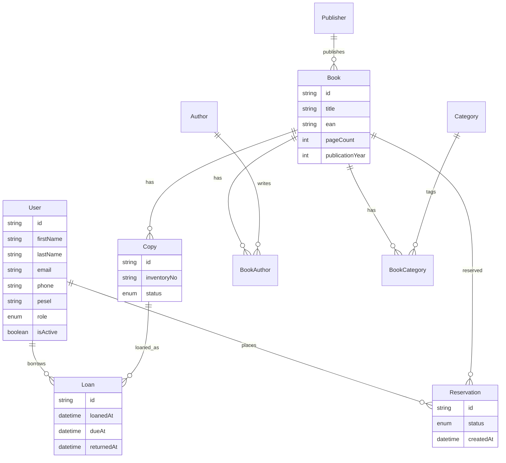

# Baza danych książek — system wypożyczeń bibliotecznych

Referencja modelu danych i logiki biznesowej projektu BD2P oraz instrukcja uruchomienia aplikacji (T3 Stack: Next.js, TypeScript, Tailwind, tRPC, Prisma, PostgreSQL, Better Auth, Biome, pnpm).

Nazwy modeli i pól w schemacie są po angielsku ([`prisma/schema.prisma`](prisma/schema.prisma)). Ten dokument opisuje, jak encje się łączą i jakie reguły obowiązują w systemie.

## Uruchomienie

Wersja wdrożona jest dostępna w przeglądarce: [https://bd2p.vercel.app/](https://bd2p.vercel.app/).

Wymagania (lokalnie): Node.js, pnpm, Docker (opcjonalnie — skrypt `start-database.sh` uruchamia Postgresa).

1. Skopiuj env: `cp .env.example .env` i ustaw `DATABASE_URL` oraz `BETTER_AUTH_SECRET`.
2. Uruchom Postgres (np. `./start-database.sh` albo własna instancja).
3. Zainstaluj zależności: `pnpm install`
4. Zsynchronizuj schemat: `pnpm db:push` (lub `pnpm db:generate` dla migracji)
5. Dev server: `pnpm dev` → [http://localhost:3000](http://localhost:3000)

Auth: **Better Auth** z **email + hasło** (`emailAndPassword`). Endpointy pod `/api/auth/*`. Hasła są w tabeli `account` (`Account.password`), nie w `User`.

Przydatne skrypty: `pnpm check` (Biome), `pnpm typecheck`, `pnpm db:studio`.

## Cel systemu

System obsługuje katalog biblioteczny oraz wypożyczenia. Kluczowe założenie modelowe: **rozdzielamy wydanie bibliograficzne (`Book`) od fizycznego egzemplarza (`Copy`)**. Wypożycza się egzemplarz, nie „książkę” jako opis.

## Diagram ERD



## Encje

| Model | Znaczenie |
| ----- | --------- |
| `User` | Konto użytkownika biblioteki lub administratora (Better Auth + pola domenowe: kontakt, PESEL, rola, aktywność). Hasło jest w `Account`. |
| `Author` | Autor publikacji (imię, nazwisko). |
| `Publisher` | Wydawnictwo. |
| `Category` | Kategoria / gatunek katalogowy. |
| `Book` | Opis wydania: tytuł, EAN/ISBN, liczba stron, rok, wydawnictwo. **Nie** reprezentuje fizycznej sztuki na półce. |
| `BookAuthor` | Tabela łącząca książkę z autorami (M:N) oraz kolejność autorstwa (`authorOrder`). |
| `BookCategory` | Tabela łącząca książkę z kategoriami (M:N). |
| `Copy` | Fizyczny egzemplarz danej książki: numer inwentarzowy i status (`AVAILABLE`, `LOANED`, `LOST`, `MAINTENANCE`). |
| `Loan` | Wypożyczenie egzemplarza przez użytkownika: data wypożyczenia, termin zwrotu, opcjonalna data zwrotu. |
| `Reservation` | Rezerwacja **wydania** (`Book`), gdy brak wolnego egzemplarza. |

Liczba dostępnych sztuk **nie** jest osobną kolumną — wynika z liczby rekordów `Copy` o statusie `AVAILABLE` dla danej książki (ew. z widoku SQL).

## Relacje

### 1:N (jeden do wielu)

- **`Publisher` → `Book`** — jedno wydawnictwo ma wiele wydań.
- **`Book` → `Copy`** — jedno wydanie ma wiele egzemplarzy fizycznych.
- **`Book` → `Reservation`** — wiele rezerwacji kolejki na to samo wydanie.
- **`User` → `Loan`** — historia i aktywne wypożyczenia użytkownika.
- **`User` → `Reservation`** — rezerwacje złożone przez użytkownika.
- **`Copy` → `Loan`** — historia wypożyczeń danego egzemplarza (w tym co najwyżej jedno aktywne).

### M:N (wiele do wielu) przez tabele łączące

- **`Book` ↔ `Author`** przez `BookAuthor`  
  Jedna książka może mieć wielu autorów; jeden autor — wiele książek.  
  `authorOrder` ustala kolejność (1 = autor główny).  
  Ograniczenie: `@@unique([bookId, authorId])` — ten sam autor nie może być dwa razy przypisany do tej samej książki.

- **`Book` ↔ `Category`** przez `BookCategory`  
  Książka może należeć do wielu kategorii.  
  Klucz złożony: `@@id([bookId, categoryId])`.

### Relacje transakcyjne

- **`Loan`** łączy **`User` + `Copy`** — wypożyczenie dotyczy egzemplarza.
- **`Reservation`** łączy **`User` + `Book`** — rezerwacja dotyczy wydania (kolejka czeka na *jakikolwiek* wolny egzemplarz).

```
Publisher ──< Book >── Copy >── Loan >── User
              |  |                ^
              |  +── Reservation ─┘
              +── BookAuthor >── Author
              +── BookCategory >── Category
```

## Logika biznesowa

Reguły egzekwowane w aplikacji (i częściowo w Postgresie — patrz sekcja na końcu).

### Wypożyczenia (`Loan`)

1. Wypożycza się wyłącznie `Copy`, nigdy bezpośrednio `Book`.
2. Aktywne wypożyczenie: `returnedAt IS NULL`.
3. Na dany `Copy` może istnieć **co najwyżej jedno aktywne** wypożyczenie.
4. Użytkownik z rolą `MEMBER` może mieć **maksymalnie 5 aktywnych** wypożyczeń.
5. Jeśli użytkownik ma przynajmniej jedno przeterminowane wypożyczenie (`dueAt < now()` i `returnedAt IS NULL`), **nie może** brać kolejnych.
6. Użytkownik z `isActive = false` nie może wypożyczać ani rezerwować.
7. Przy wypożyczeniu: status `Copy` → `LOANED`.
8. Przy zwrocie: ustawiane jest `returnedAt`, status `Copy` → `AVAILABLE` (o ile egzemplarz nie jest `LOST` / `MAINTENANCE`).
9. Wypożyczać można tylko egzemplarz ze statusem `AVAILABLE`.

### Rezerwacje (`Reservation`)

1. Rezerwacja dotyczy `Book` (wydania), nie konkretnego `Copy`.
2. Rezerwację można utworzyć **tylko**, gdy dla danej książki nie ma żadnego `Copy` ze statusem `AVAILABLE`.
3. Użytkownik może mieć **co najwyżej jedną** rezerwację ze statusem `PENDING` na daną książkę.
4. Statusy: `PENDING` → `FULFILLED` (przy realizacji wypożyczenia) lub `CANCELLED`.

### Integralność katalogu

- `ean` książki jest unikalny.
- `inventoryNo` egzemplarza jest unikalny w całej bibliotece.
- `email` i `pesel` użytkownika są unikalne.
- Usunięcie `Book` nie usuwa automatycznie historii w sposób niekontrolowany: `Copy` ma `onDelete: Restrict` względem książki (najpierw trzeba obsłużyć egzemplarze); tabele łączące autorów/kategorii kasują się kaskadowo.

## Role aplikacji

| Rola | Uprawnienia |
| ---- | ----------- |
| `ADMIN` | CRUD książek, autorów, kategorii, wydawnictw, egzemplarzy; wypożyczenia i zwroty; zarządzanie użytkownikami (aktywacja/blokada); lista przeterminowanych wypożyczeń. |
| `MEMBER` | Przeglądanie katalogu (wyszukiwanie, filtry); własne wypożyczenia i historia; składanie/anulowanie rezerwacji; edycja własnego profilu (bez zmiany roli). |

## Mechanizmy na poziomie bazy (do wdrożenia później)

Prisma nie wyraża wszystkich ograniczeń Postgresa. Po migracji warto dodać:

- [ ] **Partial unique index** — jeden aktywny loan na egzemplarz:
  ```sql
  CREATE UNIQUE INDEX loan_one_active_per_copy
    ON "Loan" ("copyId")
    WHERE "returnedAt" IS NULL;
  ```
- [ ] **Trigger** — synchronizacja `Copy.status` przy INSERT/UPDATE `Loan` (wypożyczenie → `LOANED`, zwrot → `AVAILABLE`).
- [ ] **Widok** `v_overdue_loans` — aktywne wypożyczenia z `dueAt < now()`.
- [ ] **Widok** `v_book_availability` — dla każdej książki: liczba egzemplarzy, liczba `AVAILABLE`.
- [ ] **CHECK** — np. `dueAt > loanedAt`; format PESEL (11 cyfr) jeśli egzekwowany w DB.
- [ ] Opcjonalnie: role PostgreSQL / RLS spójne z `Role` w aplikacji.

## Pliki

- [`prisma/schema.prisma`](prisma/schema.prisma) — model Prisma (Better Auth + katalog biblioteczny).
- [`sprawozdanie.tex`](sprawozdanie.tex) — sprawozdanie kursowe.
- Ten plik — opis relacji i reguł biznesowych oraz instrukcja uruchomienia.
